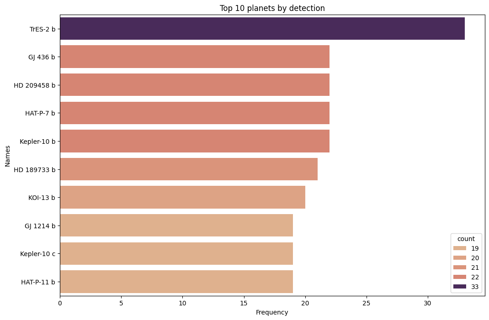
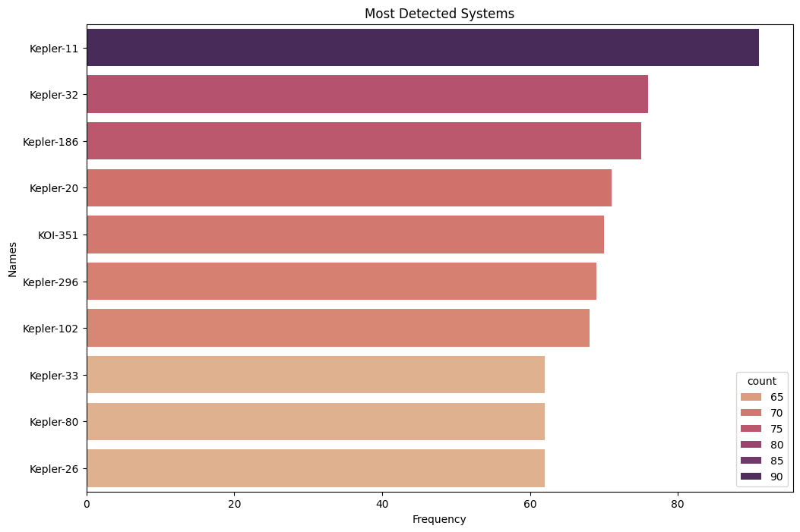

# Space_DataAnalysis_ML

This Repo Contains Code and visualization of My Exploration of Public Space Data.

Sources

    <a href="https://nexsci.caltech.edu/">NASA Planetary Data</a>
    <a href="https://github.com/winterdelta/KeplerAI?tab=readme-ov-file">
        Kepler Time Series Data</a>

From The NASA planetary Data I found out that 

TrES-2 b Was the most frequent detected planet across all the facilities. It was reported the highest amount, 33 Times in the dataset.

The Kepler-11 Was the most studied system, as it had the highest detection.
