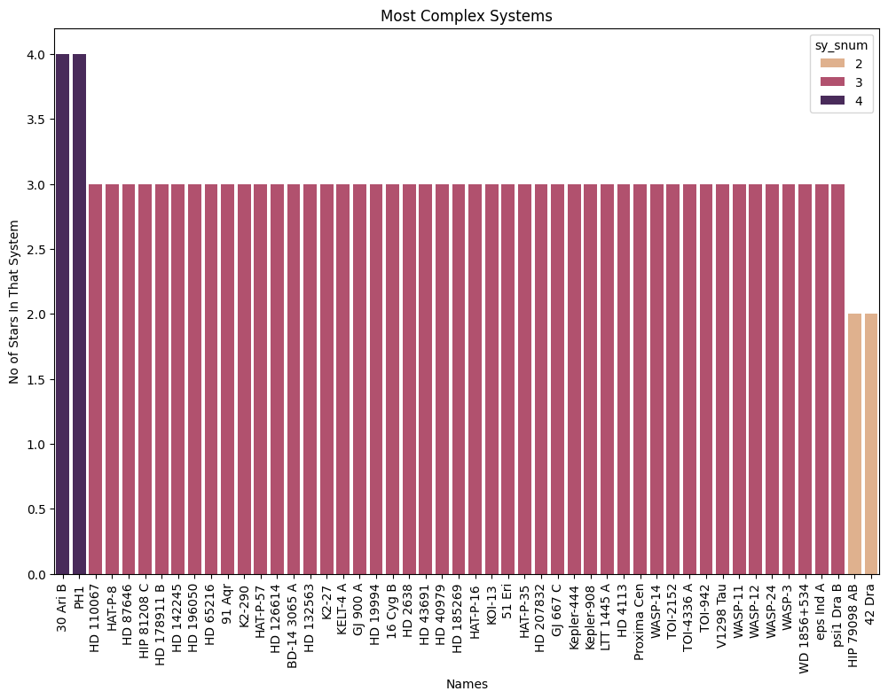
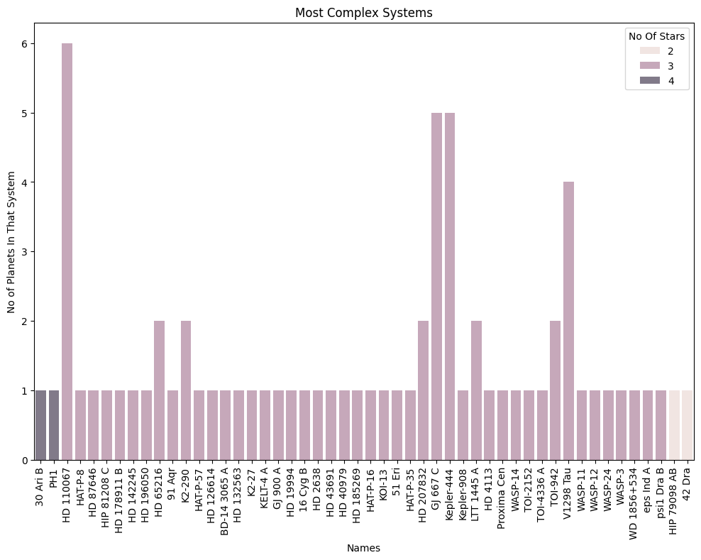
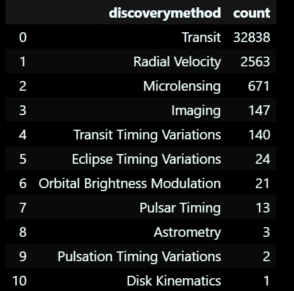
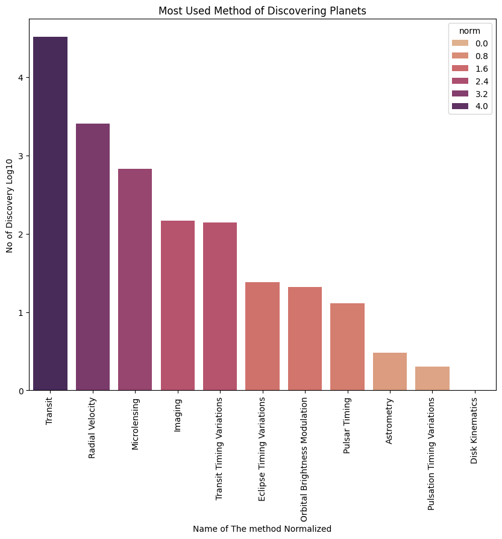

# Space_DataAnalysis_ML

This Repo Contains Code and visualization of My Exploration of Public Space Data. It has Exploration of Nasa planetary dataset and includes a ML Model for Planet Detection.

Sources:

    <a href="https://nexsci.caltech.edu/">NASA Planetary Data</a>
    <a href="https://github.com/winterdelta/KeplerAI?tab=readme-ov-file">
        Kepler Time Series Data</a>

From The NASA planetary Data I found out that 

TrES-2 b Was the most frequent detected planet across all the facilities. It was reported the highest amount, 33 Times in the dataset.

The Kepler-11 Was the most studied system, as it had the highest detection.

Here We can see the most complex systems , sy_snum = number of stars in that system. 

In those complex systems i visualized the number of planets. We can see here that HD 110067 System is one of the most complex systems out there with 3 stars and 6 planets.

The most common method for discovering exoplanets is the transit method. This involves observing a star and detecting periodic dips in its brightness caused by a planet passing in front of it, blocking some of the star's light.

This is the log10 of the count values visualized.

The top facilities that contributed to this dataset are:

| Disc Facility                                | Count |
| -------------------------------------------- | ----- |
| Kepler                                       | 26775 |
| K2                                           | 1982  |
| Transiting Exoplanet Survey Satellite (TESS) | 1469  |
| SuperWASP                                    | 955   |
| W. M. Keck Observatory                       | 642   |
| La Silla Observatory                         | 606   |
| HATNet                                       | 563   |
| Multiple Observatories                       | 551   |
| OGLE                                         | 352   |
| HATSouth                                     | 311   |
| KMTNet                                       | 270   |
| Haute-Provence Observatory                   | 162   |
| SuperWASP-South                              | 155   |
| Lick Observatory                             | 153   |
| CoRoT                                        | 130   |
| Anglo-Australian Telescope                   | 122   |
| MOA                                          | 93    |
| TrES                                         | 86    |
| Okayama Astrophysical Observatory            | 83    |
| McDonald Observatory                         | 73    |
| XO                                           | 67    |
| Qatar                                        | 66    |
| KELT                                         | 63    |
| Paranal Observatory                          | 61    |
| Roque de los Muchachos Observatory           | 59    |
| Las Campanas Observatory                     | 52    |
| Subaru Telescope                             | 43    |
| Next-Generation Transit Survey (NGTS)        | 41    |
| KELT-North                                   | 39    |
| WASP-South                                   | 39    |
